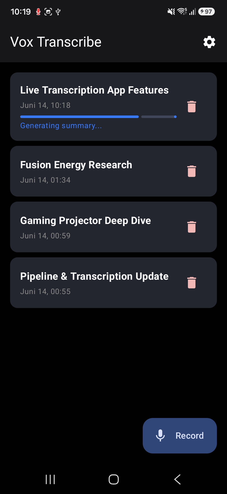
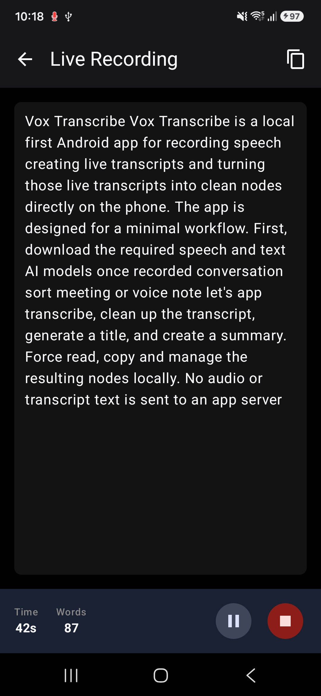
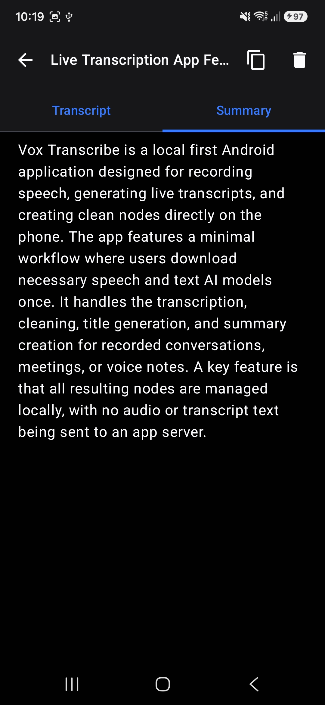
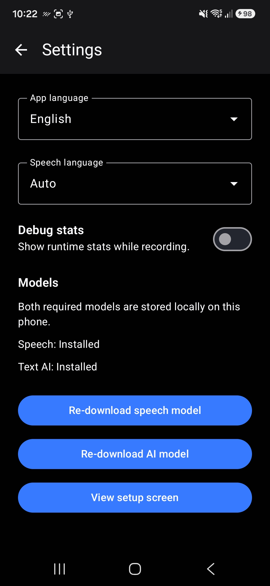

# Vox Transcribe

Vox Transcribe is a local-first Android app for recording speech, creating live transcripts, and turning those transcripts into clean notes directly on the phone.

The app is designed for a minimal workflow:

1. Download the required speech and text AI models once.
2. Record a conversation, thought, meeting, or voice note.
3. Let the app transcribe, clean up the transcript, generate a title, and create a summary.
4. Read, copy, and manage the resulting notes locally.

No audio or transcript text is sent to an app server.

## Features

- On-device live speech transcription
- Pause, resume, and stop controls during recording
- Local note storage with transcript and summary tabs
- Automatic title generation after recording
- Automatic transcript cleanup with on-device text AI
- Automatic summary generation
- Manual re-run of text AI cleanup and summary generation for existing notes
- Selectable and copyable transcript and summary text
- One-tap copy for the full note
- Minimal setup screen with direct model downloads and progress
- App language setting with system default, English, and German
- Transcription language setting with auto-detect, English, and German
- Optional debug stats for transcription performance

## Screenshots

<p align="center">
  
  
  
  
</p>

## Models

Vox Transcribe currently uses two local models:

| Purpose | Model | Runtime | Approx. download |
| --- | --- | --- | --- |
| Speech recognition | [Nemotron 3.5 ASR Streaming 0.6B ONNX INT4](https://huggingface.co/onnx-community/nemotron-3.5-asr-streaming-0.6b-onnx-int4) | ONNX Runtime GenAI | 793 MB |
| Text AI | [Gemma 4 E4B LiteRT-LM](https://huggingface.co/litert-community/gemma-4-E4B-it-litert-lm) | LiteRT-LM | 3.66 GB |

The models are not bundled in the repository or APK. The app downloads them from Hugging Face during setup and stores them locally on the device.

Gemma 4 E4B is the only supported text AI model. Smaller Gemma 4 E2B builds were tested but removed from the supported catalog because transcript cleanup quality was not sufficient.

Text AI cleanup uses conservative task-specific sampling, sentence-aware transcript chunks, and short previous-context snippets to improve long transcript cleanup without requiring a hand-written glossary.

## Privacy

Vox Transcribe is built around local inference:

- microphone audio is processed on-device
- transcripts and summaries are stored in the local Room database
- AI cleanup and summarization run on-device
- internet access is only needed to download the model files

## Requirements

- Android device with API 31 or newer
- arm64-v8a device
- At least 12 GB device memory recommended
- Several GB of free storage for local models
- Android Studio / Android Gradle Plugin compatible with the checked-in Gradle configuration
- ONNX Runtime GenAI Android native package available at `models/onnxruntime-genai-android-0.14.0`

## Building

Clone the repository and open it in Android Studio, or build from the command line:

```powershell
.\gradlew.bat assembleDebug
```

On Windows, the repository also includes a helper script for using the bundled JBR:

```powershell
.\scripts\gradlew-jbr.ps1 assembleDebug
```

The Android project builds native JNI glue for ONNX Runtime GenAI via CMake. The expected local native dependency layout is:

```text
models/
  onnxruntime-genai-android-0.14.0/
    include/
    jni/
      arm64-v8a/
        libonnxruntime-genai.so
```

Model weights are downloaded by the app at runtime and do not need to be committed to the repository.

## Tech Stack

- [Kotlin](https://kotlinlang.org/)
- [Jetpack Compose](https://developer.android.com/compose)
- [Material 3](https://m3.material.io/)
- [Room](https://developer.android.com/training/data-storage/room)
- [Hilt](https://dagger.dev/hilt/)
- [ONNX Runtime](https://onnxruntime.ai/)
- [ONNX Runtime GenAI](https://github.com/microsoft/onnxruntime-genai)
- [LiteRT-LM](https://github.com/google-ai-edge/LiteRT-LM)
- [Mike Penz Multiplatform Markdown Renderer](https://github.com/mikepenz/multiplatform-markdown-renderer)

## Acknowledgements

Vox Transcribe builds on excellent open-source and open-weight work:

- [NVIDIA Nemotron 3.5 ASR Streaming 0.6B](https://huggingface.co/nvidia/nemotron-3.5-asr-streaming-0.6b), the streaming ASR model family used for speech recognition
- [ONNX Community Nemotron 3.5 ASR Streaming 0.6B ONNX INT4](https://huggingface.co/onnx-community/nemotron-3.5-asr-streaming-0.6b-onnx-int4), the Android-friendly ONNX model package downloaded by the app
- [Gemma](https://ai.google.dev/gemma), used for local transcript cleanup, title generation, and summaries
- [LiteRT-LM](https://github.com/google-ai-edge/LiteRT-LM), used for running local text AI models on Android
- [ONNX Runtime GenAI](https://github.com/microsoft/onnxruntime-genai), used for the streaming ASR runtime integration

## License

MIT License. See [LICENSE](LICENSE) for details.
